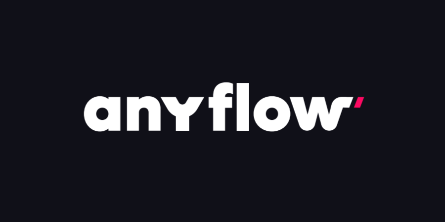

<!-- img -->

  

# Hello World 👋🏻

This project is a simple example of how to deploy the ``HelloWorld.sol`` contract in less than 5 minutes using AnyFlow.

# Usage

1. Fork this repository
2. Log into [AnyFlow](https://app.anyflow.pro)
3. Select this repository
4. Select your chains
5. Just wait for the deployment to finish

# Dependencies

The platform will automatically install the dependencies for you and handle all the deployment process including setting up the private keys, RPC providers, gas fees and more!

This project is build using the Hardhat framework.

This is what you would need to do if you were to deploy this contract manually:

1. Install the dependencies
2. Compile the contract
3. Generate a private key to create a deployer account
4. Check if the deployer has enough funds
5. If not, use a faucet to get some testnet tokens or fund your account through another means
6. Make an account on RPC provider, generate an API key and register it to the project
7. Make accounts on every block explorer you want to use to verify the contract and register the API keys to the project
8. Deploy the contract
9. Verify the contract
10. Repeat the process for each chain you want to deploy the contract on
11. Pray that your keys are not compromised

# FAQ

**Q:** Who owns the contract after it is deployed?  
**A:** If the contract is Ownable, the platform will call the `transferOwnership` function right after the deployment and transfer the ownership to the supplied address.

**Q:** What RPC providers are being used? 
**A:** The platform uses Alchemy, Infura, and Ankr.

**Q:** Which block explorers are supported? 
**A:** Currently only Etherscan.

**Q:** Where are the private keys stored? 
**A:** Private keys are stored in the platform's secure vault KMS.

**Q:** What if I do not want the contract to be verified?  
**A:** There is an option to disable the verification process.

# Feature Requests

If you have any feature requests or suggestions, please send it to us on [Discord](https://discord.gg/aCygGwBWya). Do not forget to check if the feature is already in the roadmap.

# License

This project is licensed under the MIT License - see the [LICENSE](LICENSE) file for details.

# Support us

Follow us on [X](https://x.com/anyflow_).

Join our on [Discord](https://discord.gg/aCygGwBWya).

Build with ❤️ by the [AnyFlow](https://anyflow.pro/team) team.

Bootstraped by [Khiza DAO](https://khizadao.com).
